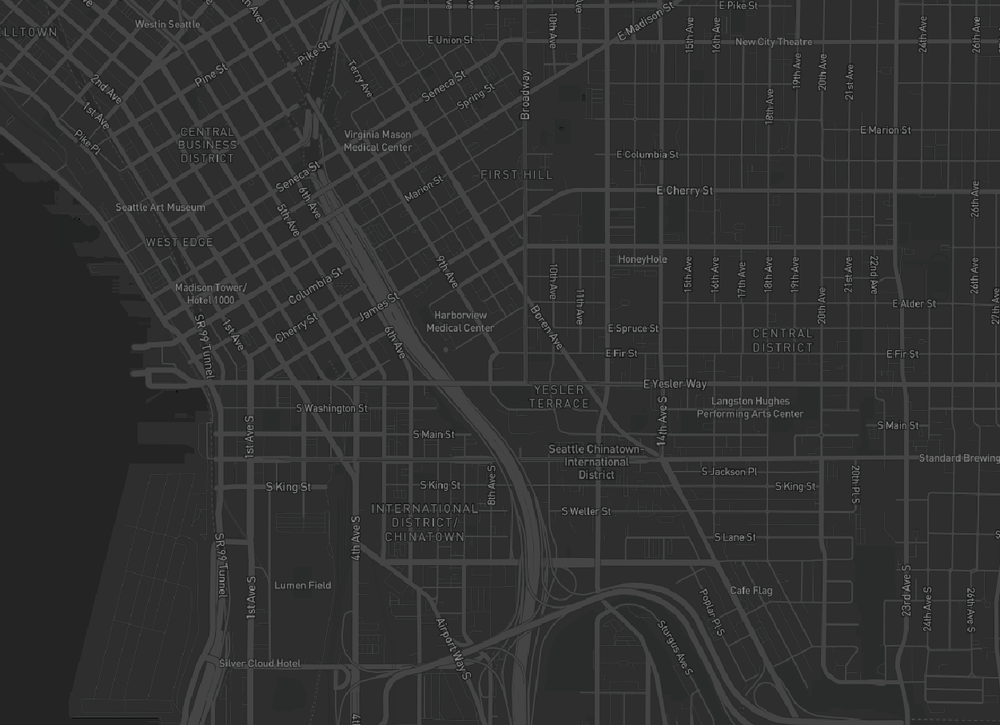
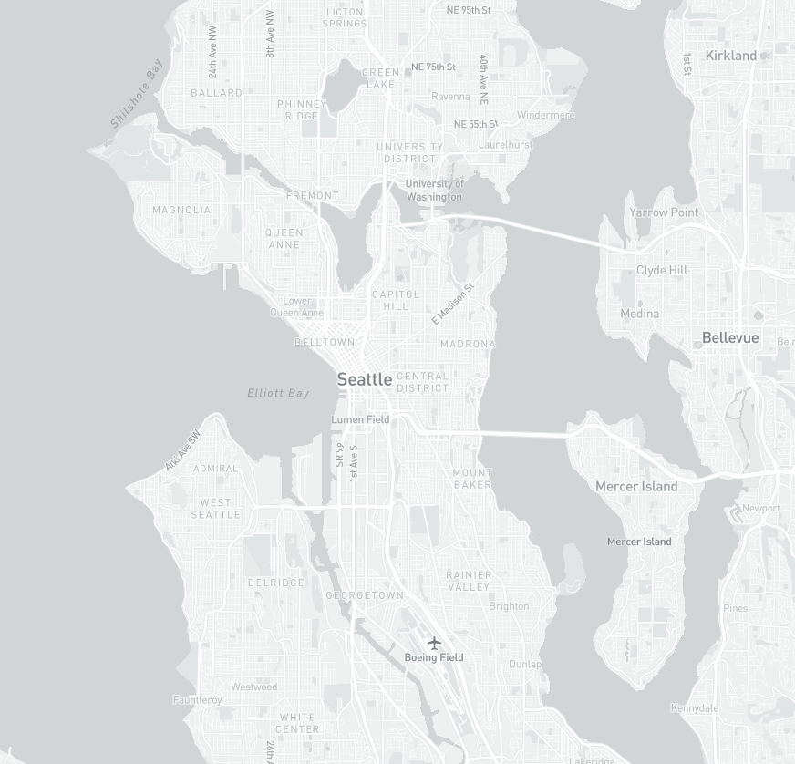
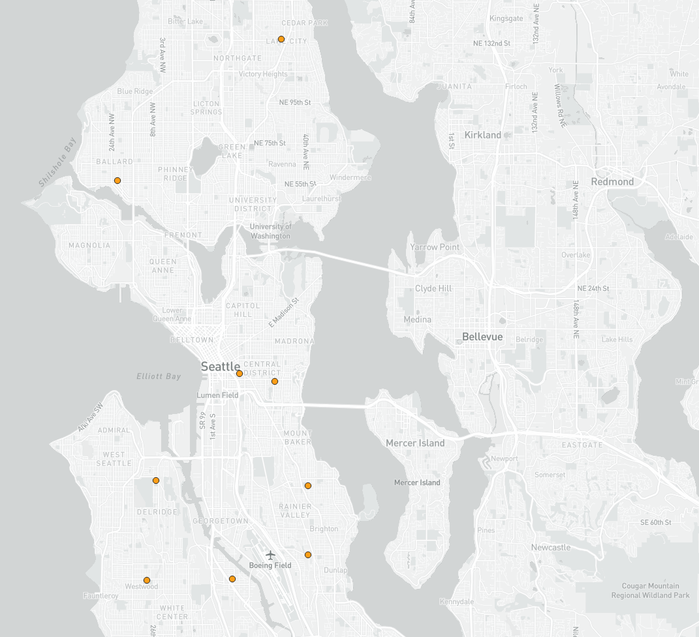
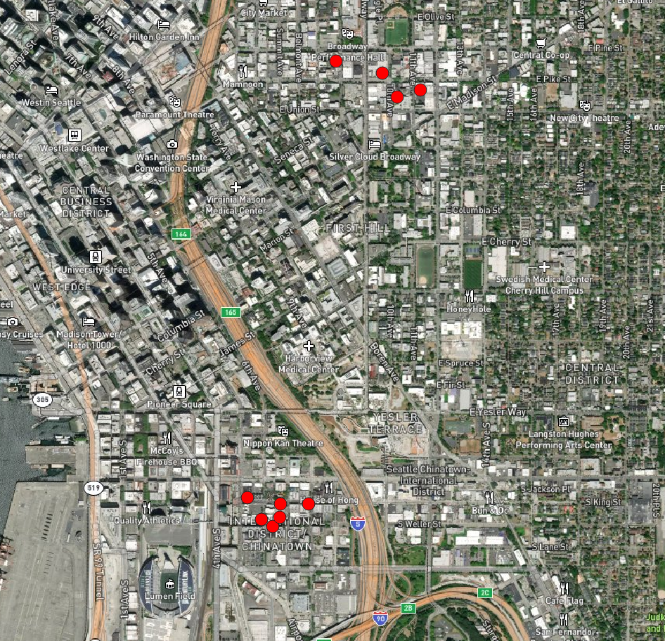

# Seattle Computer Station & Boba Map-Tiles

[Map Link](https://justin501.github.io/Map-Tiles/)

In this project, I created two tile maps, one that maps free access to computer stations in Seattle, and another of bubble tea stores in the Chinatown area. The maximum zoom level is 14.

<b>Map 1: Dark Basemap</b>
 
Default dark base map from mapbox, max zoom level 14.
</img>

<b> Map 2: Light Basemap </b>
Light base map from mapbox, tileset created in QGIS with max zoom level 14.
</img>

<b> Map 3: Free Access Computer Stations Dataset + Basemap </b>
Default dark base map from mapbox, tileset created in QGIS with max zoom level 14. The data set is from Seattle Open Data Portal, and pinpoints public computer access locations in Seattle.
</img>

<b> Map 4: Free Access Computer Stations+ Light Basemap </b>
This map uses the same dataset, but with a light base map
</img>

<b> Map 5: Satellite Basemap + Chinatown Boba Stores</b>
This map uses manually collected boba store data within the industrial district of Seattle. It also features the satellite layer.
</img>

### References

The base maps and API were referenced from
 <a href="https://www.mapbox.com/">Mapbox</a>. 
 Computer data was sourced from <a href="https://data.seattle.gov/City-Business/Public-Computer-Access-Locations/5vsq-n2rx">Seattle Open Data Portal</a>. Additionally, bubble tea store data was manually obtained through google maps regarding the boba shop map. 

Acknowledgement to professor [Jakob Zhao](https://github.com/jakobzhao/geog458/tree/master/labs/lab04/).
 
